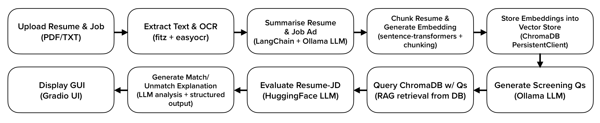

<video width="1000" height="350" controls>
  <source src="../assets/images/ResumAIScan.mp4" type="video/mp4">
</video>

In today's world of hiring—where every job description feels like a snowflake and resumes come in all shapes and forms—one-size-fits-all solutions just don’t cut it. So I decided to build something different. Something smarter. Something adaptive.
Let me introduce ResumAIScan, a prototype I crafted to tackle a challenge I’ve seen countless times: _"How can we effectively and fairly match a candidate’s resume to a job advertisement—when both documents are so inherently inconsistent, unstructured, and nuanced?"_
This post is a behind-the-scenes look at how I built it, why I made certain technical decisions, and how this tool can help both HR professionals and job seekers navigate the complexities of resume matching.

## 💡 The Problem: Every Resume and Job Ad Is Unique
If you’ve worked in recruiting or job searching, you know that even for the same job title, two job ads can look completely different. One focuses on tech stack, another on collaboration. One uses bullet points, the other tells a story.
Resumes are even worse. There is no global standard. People write them as prose, tables, bullet-point lists—or all of the above. That’s why traditional keyword-matching systems often fail. They’re rigid. They expect structure. Real-world resumes aren’t structured.

So I asked myself:
_"Can we build a system that adapts to the content itself—no matter how it’s written?"_

That’s when I leaned into a Retrieval-Augmented Generation (RAG) architecture, backed by local LLMs.

## 🙋‍♂️🙋🏻‍♀️ Who Is This App For?
This app is a powerful ally for HR professionals and recruiters who face the daunting task of sifting through countless resumes to find the right candidate. It streamlines the screening process by providing a nuanced, AI-driven match score along with detailed analysis, helping them focus on quality over quantity.

For job seekers, it acts as a personalized coach, offering insights into how well their resume aligns with a specific job posting. By highlighting strengths and pinpointing gaps, it empowers candidates to tailor their applications thoughtfully and increase their chances of landing interviews. Whether you’re hiring or applying, this system adapts to your unique context, making the often complex and opaque hiring process more transparent and effective.


## ⚙️ How Does It Work? The Tech Behind the 'Magic'
To truly grasp how ResumAIScan works, let me walk you through the end-to-end pipeline—not just what happens, but also why I chose each method and how the system is designed to be adaptive, efficient, and privacy-aware.

The following chart illustrates a high-level flow diagram that reflects the step-by-step processing logic embedded in the system.


### 1️⃣ File Input & Parsing
Users upload two files: a resume and a job ad, in either .pdf or .txt format. PDF parsing is handled using PyMuPDF, which is reliable and fast. But some PDFs, especially scanned resumes, are not machine-readable—so I use EasyOCR as a fallback.

``` python
def get_file_text(upload) -> str:
    if fname.lower().endswith(".pdf"):
        text = extract_text_from_pdf(fname) or ocr_pdf(fname)
```

Why EasyOCR? Because it's lightweight, GPU-compatible, and easier to install. It just works—especially for multilingual or scanned CVs.

### 2️⃣ Summarization with Local LLM (via Ollama)
Once I’ve got the raw text, I use an LLM to summarize both the resume and job ad. This is where Ollama shines ✨.

``` python
llm = Ollama(model="llama3.2", temperature=0.1)
summary_chain = LLMChain(llm=llm, prompt=summary_prompt)
```
Why Ollama? Because resumes contain sensitive personal data. Using a local LLM ensures privacy, security, and offline capability, with zero dependency on external APIs. I chose LLaMA3 for its balanced performance and coherent summarization quality.

The LLM is prompted to focus on core skills, experience, and qualifications—boiling down long resumes into crisp summaries that help guide the ranking model later on.

### 3️⃣ Chunking & Embedding for Vector Search
After summarizing, I split the resume into smaller “chunks” (around 500 words) to preserve context and improve searchability. Then I embed those chunks using SentenceTransformer.

```python
embedder = SentenceTransformer("sentence-transformers/all-MiniLM-L6-v2")
collection.add(
    documents=chunks,
    embeddings=embed(chunks).tolist(),
)
```
Why SentenceTransformer with MiniLM? It’s a compact, high-performance model that runs well even on CPU. It produces meaningful semantic embeddings that work great for matching intent and context, not just surface-level keywords.

These embeddings are stored in ChromaDB, a fast, persistent vector database that allows efficient RAG-style querying.

### 4️⃣ Smart Question Generation with LLM
Now here’s where it gets fun. Instead of directly comparing job and resume texts, I make the LLM act like a recruiter: it reads the job ad and generates five smart screening questions.

``` python
question_chain = LLMChain(llm=llm, prompt=question_prompt)
questions = question_chain.run({"text": job_ad})
```

This makes the match process dynamic and adaptive. Rather than predefined templates, the system tailors its evaluation based on what this specific job ad emphasizes.

### 5️⃣ RAG Retrieval from Resume
Using the questions, I perform a semantic search over the resume chunks in ChromaDB. Each question pulls the top-k matching segments from the resume.

```python
res = collection.query(query_embeddings=embed([q]).tolist(), n_results=3)
```
This gives me a list of relevant “answers” from the resume that address the job ad’s implicit and explicit requirements.

The RAG-based retrieval approach excels because it goes beyond simple keyword matching to grasp the deeper semantic meaning within both the job ad and the resume, regardless of how unstructured or varied the inputs are. By strategically generating targeted screening questions directly from the unique job requirements, the system effectively narrows down the essential information needed for comparison. This dynamic question-driven retrieval ensures the resume is evaluated against the most relevant aspects of the job description, making the matching process adaptive and precise even when faced with diverse writing styles or formats.

### 6️⃣ Resume Ranking with HuggingFace Model
Next, I evaluate the resume’s fitness using a pre-trained transformer model: "joeportnoy/resume-match-ml" from Hugging Face.

``` python
matcher_pipeline = pipeline("text-classification", model=matcher_model_name, device=device_id)
```

This model takes the summaries and contextual data and outputs a probability score—how well the candidate fits the role.

``` python
score = torch.nn.functional.softmax(outputs.logits, dim=1)[0][1].item() * 100
```

Why this model? Because it's fine-tuned specifically on resume vs job ad tasks. I considered training my own model, but using a well-trained public model allows for rapid prototyping and quite good performance out of the box.

### 7️⃣ Human-like Analysis with LLM
I go a step further: I generate a textual analysis explaining the match or mismatch, pulling from the Q&A result and resume vs. job ad matching score.

``` python
analysis_chain.run({
  "job_text": job_text,
  "score": f"{score:.1f}",
  "answers": "\n".join(answers)
})
```

This step adds transparency. Instead of just saying “58% match”, the LLM articulates why, offering guidance to both recruiters and applicants.


## 👩🏻‍💻 Design Philosophy: Why This Pipeline Works
What makes this system robust is its flexibility and human-like adaptability. No two job ads are identical. No two resumes follow the same format. So I let the AI adapt to each context by combining RAG, embeddings, and LLMs.

- Local-first design ensures data privacy, essential for handling sensitive resumes.
- RAG-based retrieval goes beyond keywords or phrases matching, it allows semantic understanding, no matter how unstructured the input.
- Transformer-based matching gives statistical rigor.
- LLMs help to provide more descriptive results, which improves the understanding of the job ad vs. the resume matching analysis score.

This isn't just a bunch of AI models stitched together. It's a thoughtfully designed system that 'thinks' before it produces the output.

## 🚀 Future Improvements
This is just the prototype—and I see lots of room to grow:

### ⚡ Speed & Latency
- The analysis could be optimized with async processing, GPU acceleration for embedding/LLMs, and lazy evaluation.
- Using quantized or distilled LLMs (e.g. TinyLlama, Phi-2) can cut inference time without sacrificing quality.

### 📈 Embedding Tuning
Currently, I use all-MiniLM-L6-v2 from SentenceTransformers, Fine-tuning on resume/job datasets could boost semantic matching significantly.

### 🧾 Bulk Resume Analysis
- Enable drag-and-drop support for multiple resumes + 1 job ad. 
- Process in batch with multiprocessing, and return ranked lists.

### ☁️ Scalable Architecture
Although this demo runs smoothly on a personal machine, it’s built with scalability in mind to handle more resumes, faster processing, and multiple users simultaneously. Packaging the app with Docker ensures it can run reliably and consistently whether on your local machine or a cloud environment. For larger-scale deployments, platforms like AWS, Azure, or Google Cloud provide the infrastructure to host the app and support background task management with tools like Celery and Redis, which help queue and process resume analyses efficiently.

For managing large volumes of resume data, the vector database plays a critical role. While this demo uses ChromaDB, other popular vector databases such as Pinecone or Weaviate offer scalable, cloud-native options optimized for high-speed similarity search and retrieval. These services simplify handling thousands or even millions of document embeddings with minimal latency.

Regarding the language model, this demo uses Ollama to run a large language model locally, which is essential for privacy because resumes contain sensitive personal data. However, for even more scalable solutions, you might consider smaller, optimized models on the cloud or locally. Techniques like quantization and knowledge distillation enable compressing larger models into smaller, faster versions that retain most of their original performance. This allows you to keep the model running locally or in a private cloud environment, maintaining data privacy while reducing computational resources and latency. The trade-off is that smaller models may slightly lose accuracy or nuance in complex language understanding compared to their full-size counterparts.

In contrast, fully cloud-hosted models (such as those from OpenAI or the HuggingFace Inference API) offer state-of-the-art performance without local hardware requirements, but this comes with considerations around data privacy, latency due to network calls, and potential costs at scale.

By combining these strategies—containerization, scalable cloud services, efficient vector databases, and optimized language models—you can build a system that balances privacy, performance, and scalability, whether processing dozens or thousands of resumes.

## 🌟 Final Thoughts
I didn’t build ResumAIScan to replace recruiters or job boards. I built it because I believe we can use AI to elevate how we match people with opportunities. Matching isn’t just about checking boxes—it’s about understanding nuance. Language. Intention.

This app is a small step toward that vision. One where resumes are evaluated for what they mean, not just what they say.

If you're an HR leader, a data scientist, or just someone curious about where AI is going—give the demo a try. Let me know what you'd improve. Let’s build smarter hiring tools, together.


