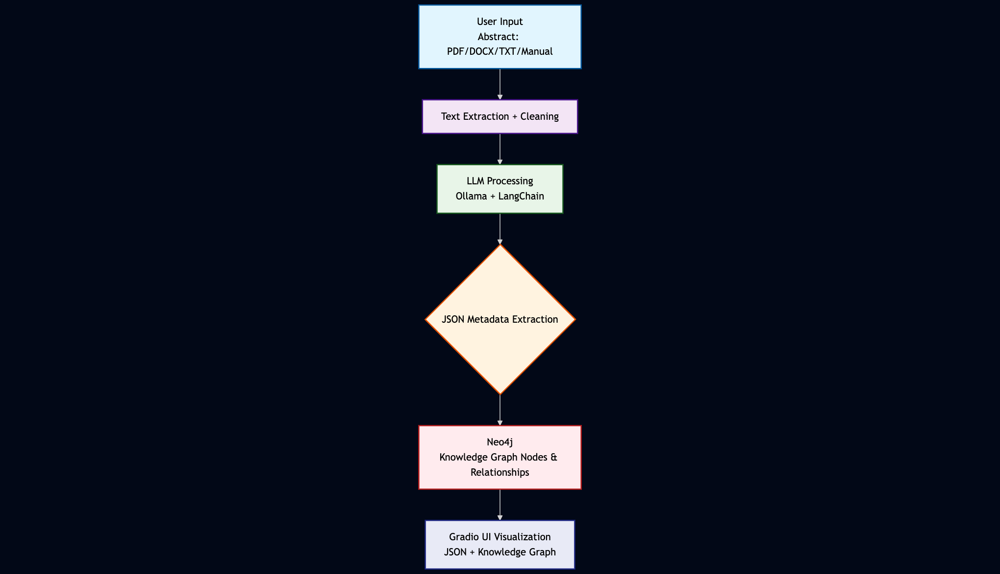

<iframe width="1000" height="350" 
        src="https://www.youtube.com/watch?v=BJTpdA6urRQ" 
        title="YouTube video player" 
        frameborder="0" 
        allow="accelerometer; autoplay; clipboard-write; encrypted-media; gyroscope; picture-in-picture" 
        allowfullscreen>
</iframe>

As someone passionate about **Natural Language Processing (NLP)**, **knowledge graphs**, and making research more accessible, I wanted to explore a project that combines these technologies in a practical way. The result is my **Research Abstract Metadata Extractor**, an interactive demo that extracts structured information from research abstracts and visualizes it in a knowledge graph.

---

## Why Focus on Abstracts?

When working with research articles, the **abstract** is the perfect starting point. It’s concise, standardized, and ideally contains the **key elements** of a study:

* The **research topic**
* The **methodology used**
* The **dataset** (or at least the type of data)
* The **major results**
* Relevant **keywords**

By focusing on the abstract, I can extract essential metadata **without needing access to the full article**, which is often behind paywalls. This also makes the demo lightweight, fast, and practical for anyone to try.

---

## How the Demo Works

The demo combines several technologies into a smooth, end-to-end workflow:

1. **Text Input**

   * Users can upload an abstract as a PDF, DOCX, or TXT file, or paste it directly into the interface.

2. **Metadata Extraction with LLM**

   * I use a **local Ollama LLaMA model** orchestrated through LangChain to parse the abstract and extract key information as JSON.

3. **Ontology-Inspired Knowledge Graph**

   * Each abstract is represented as a node in a Neo4j AuraDB knowledge graph, linked to nodes representing **topics, methodologies, datasets, results, and keywords**.
   * Relationships follow the structure of a simple ontology I defined, making the visualization intuitive and meaningful.

4. **Interactive Visualization**

   * I integrated PyVis and Gradio so users can **see the knowledge graph immediately** in the browser.
   * Different node classes are colored distinctly, and all relationships are clearly labeled.

---

## Why This Demo Is Exciting

* It demonstrates how **LLMs and knowledge graphs** can work together to transform unstructured text into structured, visual knowledge that’s easy to explore.
* The app is fully **interactive**: users can submit an abstract, and within seconds see both the extracted metadata and a rich, intuitive knowledge graph visualization.
* This demo serves as a **foundation for future research analytics**—for example, analyzing trends across multiple studies in terms of datasets, methodologies, or research topics. It could also help identify emerging patterns, highlight commonly used methods, or reveal connections between research themes, all from abstracts alone.

---

## Future Improvements

While the demo works well in its current form, I envision several exciting enhancements for the future:

* **Full ontology integration**: Currently, the knowledge graph is loosely inspired by the ontology. In the next iteration, I plan to dynamically generate Neo4j nodes and relationships directly from a **rich, formal ontology**, ensuring that the graph strictly follows the defined schema and relationships.
* **Multi-abstract visualization**: I aim to allow users to input **multiple abstracts simultaneously** and visualize how topics, methods, datasets, and results interconnect across studies. This will make it easier to spot trends, overlaps, or gaps in research areas.
* **Enhanced metadata extraction**: By refining the LLM prompts and incorporating validation rules, I plan to ensure that JSON output is **always complete, accurate, and parseable**, reducing errors and improving reliability.
* **Advanced analytics and insights**: Future versions could include features like identifying the **most common methodologies**, **frequently used datasets**, or **emerging keywords** across multiple abstracts, turning the demo into a lightweight research intelligence tool.
  
---

## How to Try It

If you want to explore the demo yourself, follow the instructions in the repository:

1. Clone the repository from GitHub: [Link](https://github.com/yourusername/research-abstract-extractor)
2. Follow the setup and usage instructions in the README there, including configuring your **Neo4j AuraDB credentials** in a `.env` file.
3. Launch the Gradio app and submit an abstract to see the extracted metadata and interactive knowledge graph.

---

## Conclusion

I built this project to combine **my interest in NLP, LLMs, and knowledge graphs** into something interactive and practical. While it currently focuses on **single abstracts**, it already demonstrates the power of combining structured metadata with visualization.

In the future, integrating the ontology fully and allowing multi-abstract exploration could turn this demo into a **powerful research exploration tool**.

---
