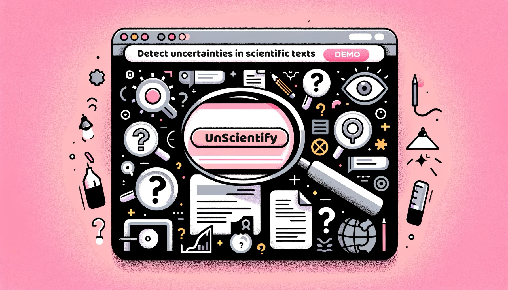
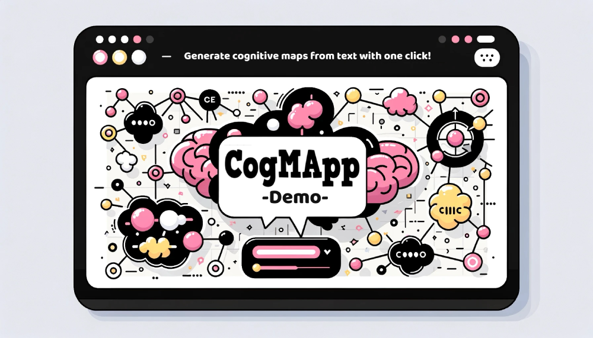
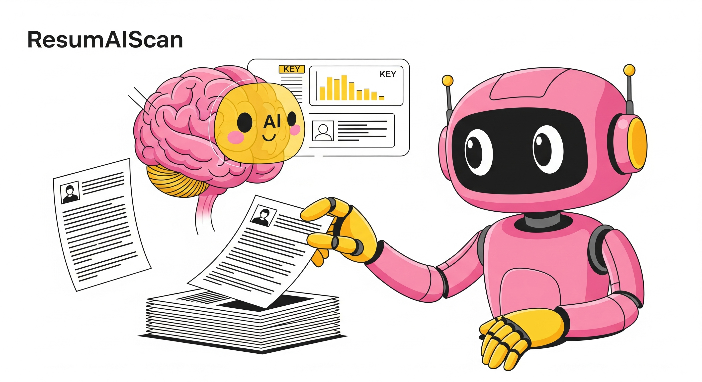
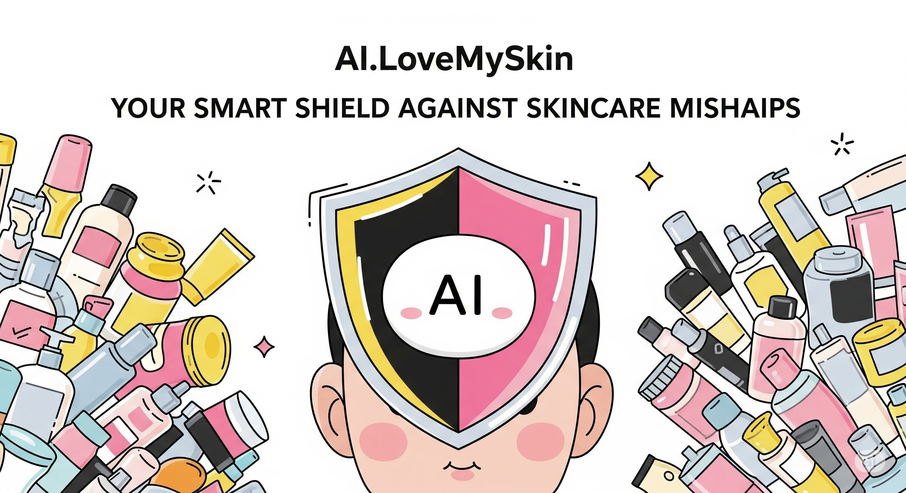

***
Due to confidentiality agreements and the policies of some institutions I’ve collaborated with, a portion of my work is kept in private repositories. However, I’m excited to share several publicly accessible projects, including language models I’ve created or fine-tuned, which are available on my HuggingFace repository: [here](https://huggingface.co/ningrumdaud)

Below, you’ll find a selection of my public projects that showcase my skills and passions.

Thank you for stopping by — this page will be updated regularly with new work and insights. Stay tuned! :)

***

    
    
With just one click, UnScientify can help you detect uncertainties in scientific texts and their authorial references, revealing the true source behind each statement. <em>(Click the image to view UnScientify demo)</em>

***

    
    
CogMApp - a cognitive map analysis tool from text. Cognitive maps are a great way to visualize and understand the relationships between different concepts. CogMApp utilizes Natural Language Processing (NLP) techniques to extract and visualize these relationships. <em>(Click the image to view CogMApp demo)</em>

***

    
    
ResumAIScan leverages cutting-edge Large Language Models (LLMs) and Retrieval Augmented Generation (RAG) to intelligently scan resumes, extract key information, generate targeted screening questions, and provide a comprehensive match analysis against job requirements. <em>(Click the image to view ResumAIScan demo)</em>

***

    
    
AI.LoveMySkin is a Skincare Ingredient Compatibility Checker. It is simple yet powerful demo app designed to demystify ingredient interactions and help you avoid adverse reactions <em>(Click the image to view AI.LoveMySkin demo)</em>

